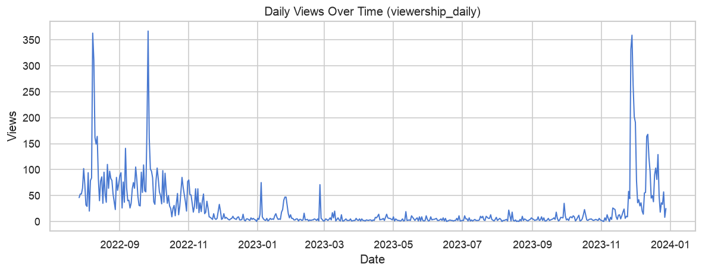
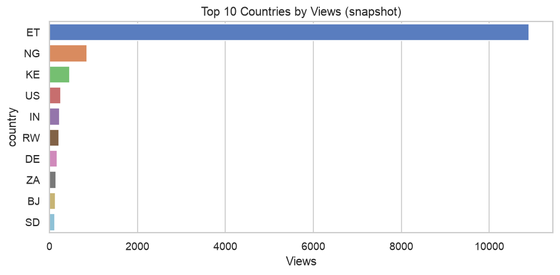
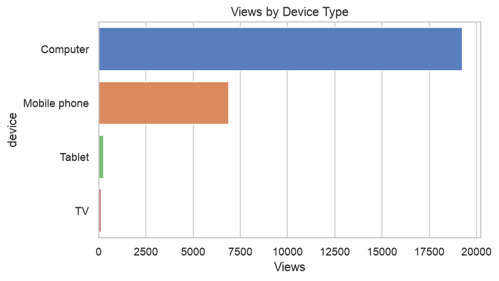
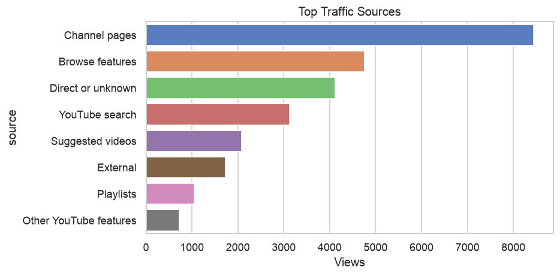
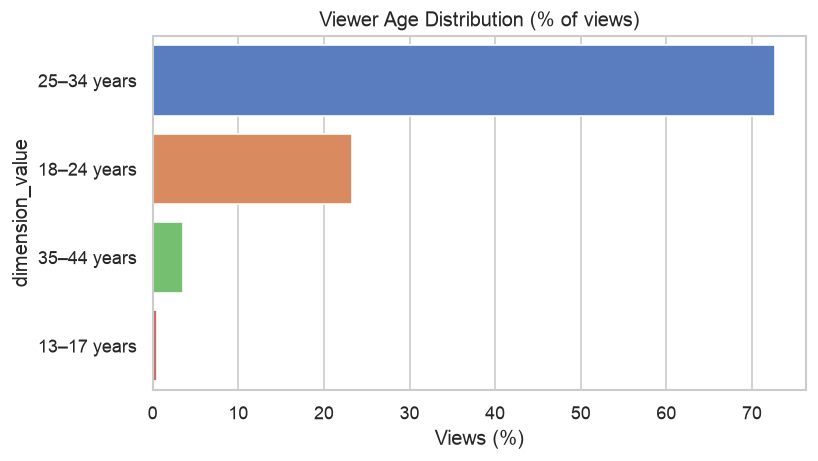

# Task 2c: YouTube Analytics EDA Findings

> Generated: 2026-07-04 10:40

## 1. Data inventory

| table_name              |   rows |
|:------------------------|-------:|
| dimension_metrics_daily | 121505 |
| dimension_snapshots     |    105 |
| report_metadata         |     14 |
| viewership_daily        |    500 |

## 2. Channel performance

- **Date range in DB:** 2022-07-27 → 2023-12-28
- **Total views (summed daily rows):** 13,189
- **Total watch time:** 925.37 hours
- **Note:** `viewership_daily` holds top-500 days from YouTube export; channel snapshot total is 26,625 views.

## 3. Audience geography

| country   |   views |
|:----------|--------:|
| ET        |   10903 |
| NG        |     854 |
| KE        |     460 |
| US        |     260 |
| IN        |     228 |
| RW        |     221 |
| DE        |     173 |
| ZA        |     154 |
| BJ        |     134 |
| SD        |     116 |

**Insight:** `ET` drives the largest share of views — prioritize in geo dashboards and NL→SQL examples.

## 4. Device & traffic

### Devices
| device       |   views |   pct |
|:-------------|--------:|------:|
| Computer     |   19267 |  72.6 |
| Mobile phone |    6885 |  25.9 |
| Tablet       |     257 |   1   |
| TV           |     132 |   0.5 |

**Insight:** `Computer` dominates; mobile is the secondary segment to compare in chatbot demos.

### Traffic sources
| source                 |   views |   impressions |   impressions_ctr_pct |
|:-----------------------|--------:|--------------:|----------------------:|
| Channel pages          |    8444 |        218825 |                  2.95 |
| Browse features        |    4759 |        109132 |                  3.43 |
| Direct or unknown      |    4123 |           nan |                nan    |
| YouTube search         |    3123 |         93094 |                  2.73 |
| Suggested videos       |    2080 |        172968 |                  0.82 |
| External               |    1730 |           nan |                nan    |
| Playlists              |    1056 |         12496 |                  5.64 |
| Other YouTube features |     729 |           nan |                nan    |

## 5. Demographics

| report_type   | dimension_value   |   views_pct |   watch_time_pct |
|:--------------|:------------------|------------:|-----------------:|
| viewer_age    | 25–34 years       |       72.7  |            71.66 |
| viewer_age    | 18–24 years       |       23.27 |            26.91 |
| viewer_age    | 35–44 years       |        3.54 |             1.42 |
| viewer_age    | 13–17 years       |        0.49 |             0.01 |
| viewer_gender | Male              |       79.84 |            76.62 |
| viewer_gender | Female            |       20.16 |            23.38 |

**Insight:** 25–34 age group accounts for ~73% of views; male viewers ~80% of views (percentage-based snapshot).

## 6. Implications for the LLM chatbot

| Finding | Chatbot use case |
|---------|------------------|
| Computer > Mobile views | Demo query: compare device types |
| ET top geography | Demo query: views from Ethiopia |
| Channel pages top traffic source | Explain acquisition mix |
| Snapshot vs daily tables | Route time-series vs summary questions |
| `report_metadata` seeded | RAG / schema context for Task 4 |

## 7. Figures

### Daily view trend

### Top geographies

### Device breakdown

### Traffic sources

### Age demographics

## 8. Suggested Redash dashboards (Task 3 preview)

1. **Channel KPIs** — daily views line chart (`viewership_daily`)
2. **Audience** — geography bar chart + device pie (`dimension_snapshots`)
3. **Acquisition** — traffic source table with impressions/CTR
4. **Demographics** — age/gender percentage charts
